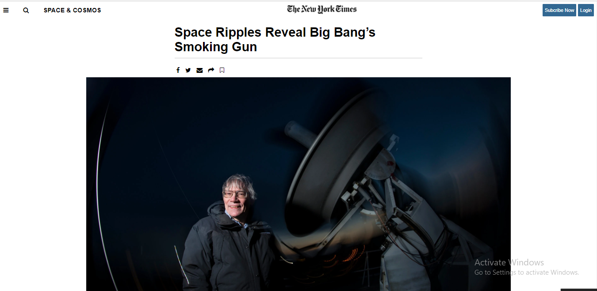

# New York Times Website Clone Project

First project of Faith Ngani and Elvis Kariithi Githinji

<h1>Additional description about the project and its features.</h1>

This is a project to demonstrate the exisiting knowledge of HTML and CSS It is a collaborative project which shows the clone of Newyorktimes.com

<i>Built With HTML5, CSS3, GIT, and VSCODE</i>

#Live Demo : https://karvel-code.github.io/NewYorkTimes-Article-/

<h1>Getting Started</h1>

To get a local copy up and running follow these simple example steps.

1. Go to https://github.com/karvel-code/NewYorkTimes-Article-/tree/features/homepage
2. Click on code and copy the html code.
3. Use git bash to clone this repository on your local machine.
4. Run git checkout -b your-branch-name Make your contributions
5. Push your branch up to your forked repository
6. Open a Pull Request with a detailed description to the development branch of the original project for a review

Prerequisites Text editor, Github profile and Git.

<h2>Authors</h2>

👤 Faith Ngani

- Github: [@nganifaith] (https://github.com/nganifaith)
- Linkedin: [Kongnyu Faith Ngani] (https://www.linkedin.com/in/ngani-faith/)
- Twitter: [@Bright_Ngani]

👤 Elvis Kariithi

- Github: [@karvel-code](https://github.com/karvel-code)
- Linkedin: [Elvis Kariithi](https://www.linkedin.com/in/elvis-kariithi-b6b5b31b6/)

🤝 Contributing Contributions, issues and feature requests are welcome!

Feel free to check the issues page.

Show your support Give a ⭐️ if you like this project!

📝 License This project is a collaboration project of microverse students. All rights are reserved for Faith Ngani and Elvis Kariithi
